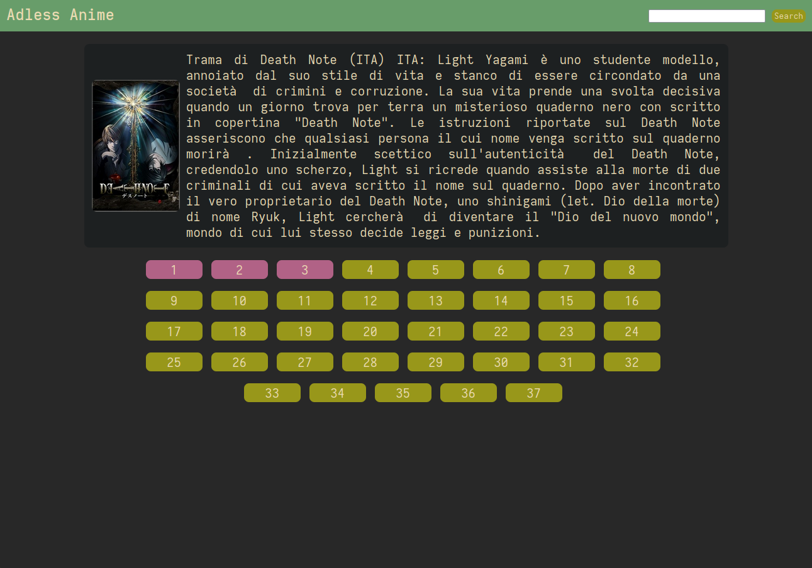
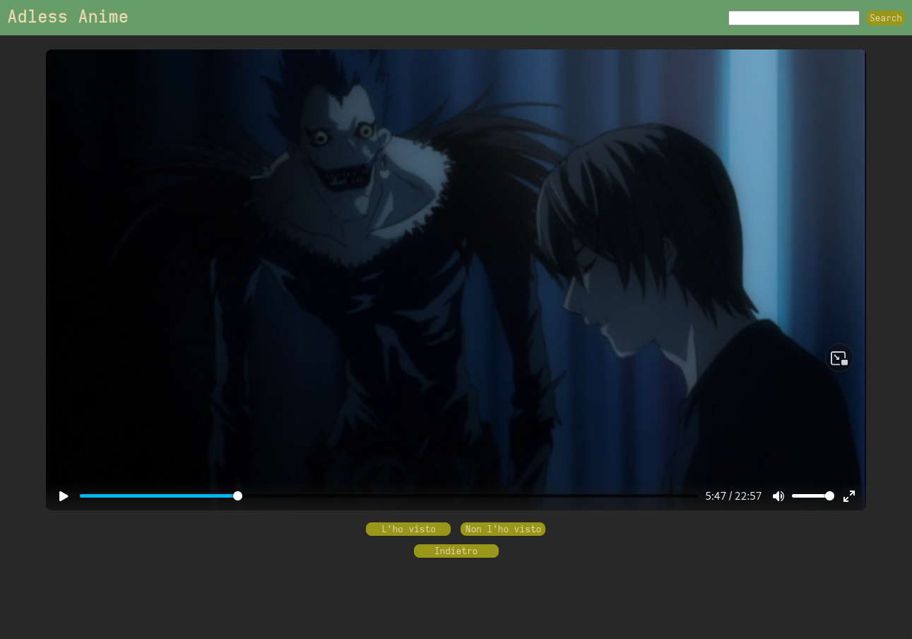

# Adless Anime
Adless Anime è un sito che prende dati da https://www.animeworld.tv/ e permette di consumare gli anime senza pubblicità, utile per le televisioni con browser senza adblock 

## Funzioni
- Ricerca di anime  
- Descrizione e copertine degli anime  
- Impostare episodi come "gia visti"  

## Screenshots
  
  
  

## Installazione
### Manuale
Python 3.7+ dovrebbe andare bene, le dipendenze di python sono: `requests bs4 flask`, usare pip o installarle tramite la repository della tua distro, una volta installato il necessario, runnare con:  
```
flask run --host 0.0.0.0 --port <porta>
```

### Usando docker
Il progetto include un Dockerfile, ma questo ancora non è il metodo consigliato, per ora, usare il metodo manuale  